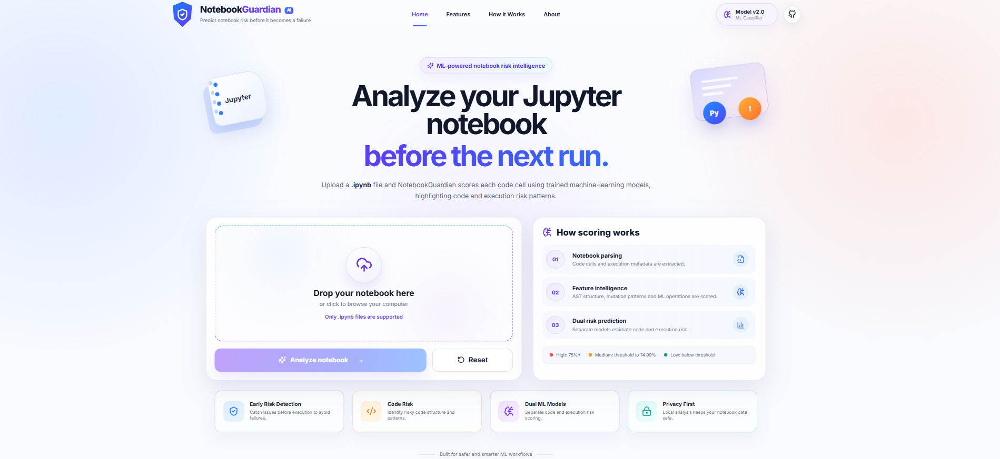
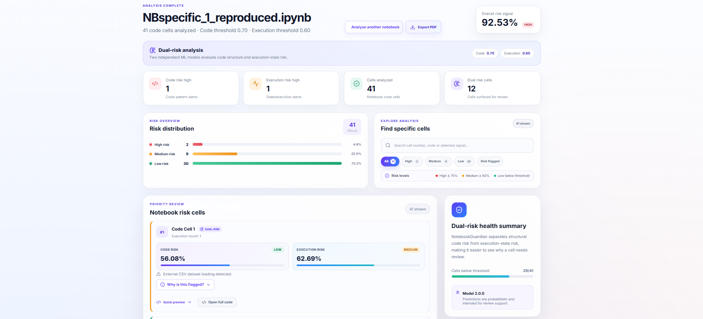
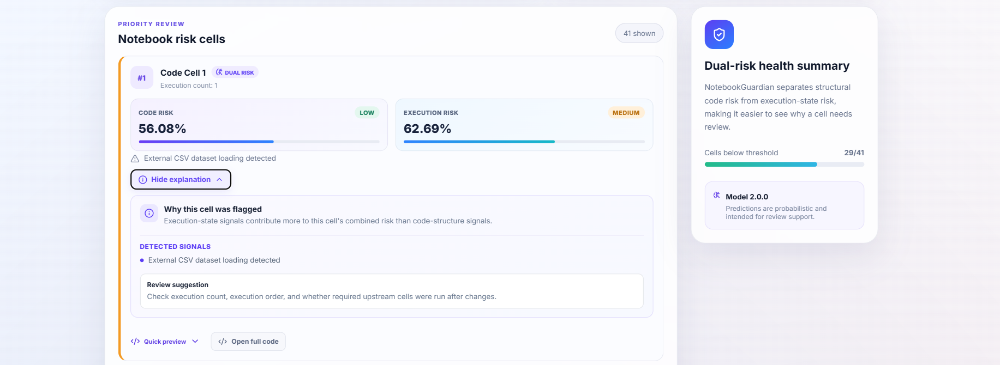
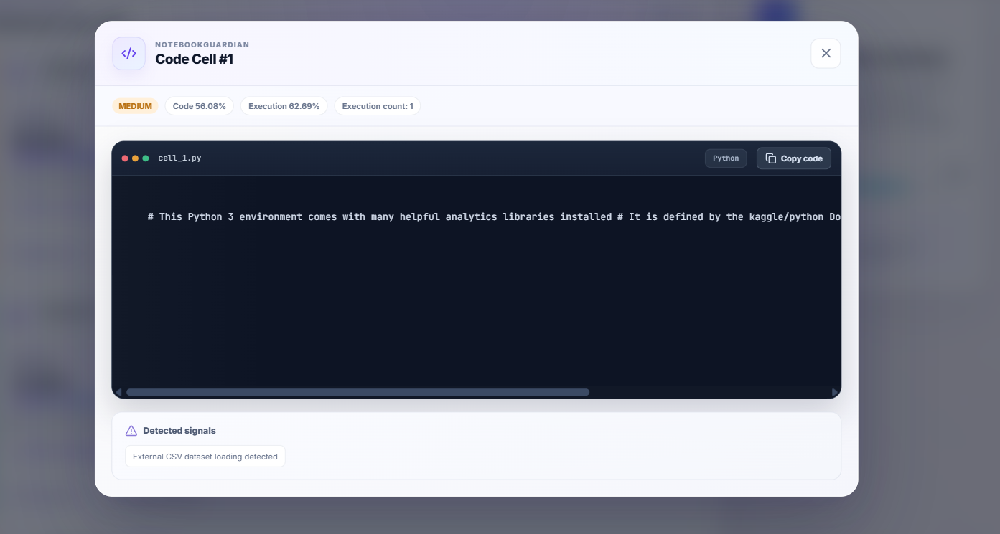
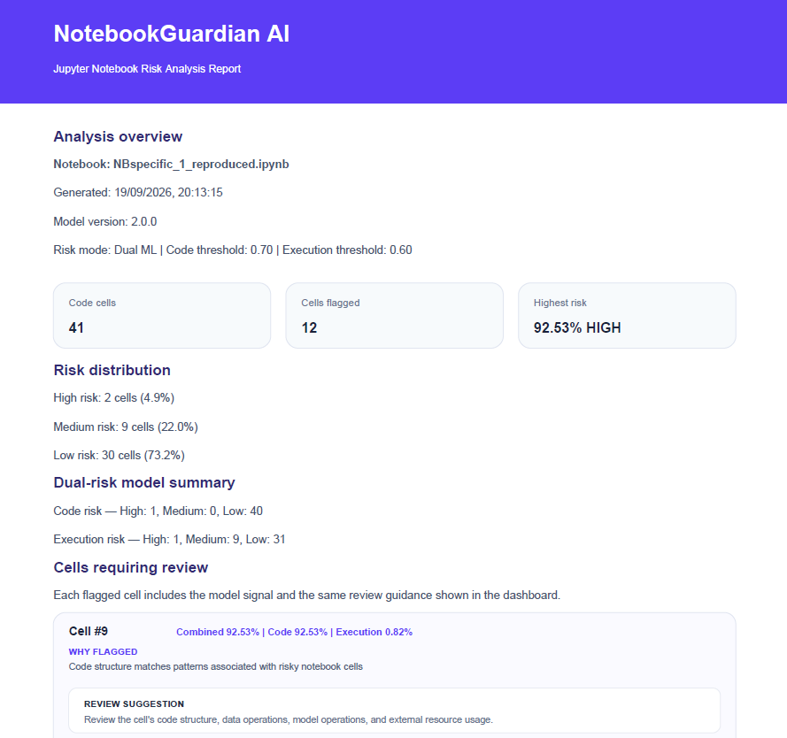

# 🛡️ NotebookGuardian AI

> **AI-powered Jupyter Notebook risk analysis and review assistant**

NotebookGuardian AI analyzes Jupyter Notebook (<code>.ipynb</code>) files at the **cell level** and separates potential **code-structure risk** from **execution-state risk**.

It combines Python/AST-based feature extraction, machine-learning models, notebook execution metadata, explainable risk signals, and a production web dashboard to help users identify notebook cells that may deserve review.

  <a href="https://notebook-guardian-ai.vercel.app/"><strong>🌐 Live Demo</strong></a>
  ·
  <a href="https://github.com/Ashutosh9-pan/NotebookGuardian-AI"><strong>💻 GitHub</strong></a>

---

## 🚀 Production

| Service | Deployment |
|---|---|
| **Frontend** | Vercel — React + Vite |
| **Backend** | Render — FastAPI + Uvicorn |
| **ML Inference** | scikit-learn + Joblib |
| **Source Control** | GitHub |

**Live Application:** https://notebook-guardian-ai.vercel.app/

**Backend API:** https://notebookguardian-ai-1.onrender.com/

---

## ✨ Key Features

- 📓 Upload and analyze Jupyter Notebook (<code>.ipynb</code>) files
- 🤖 ML-powered cell-level risk detection
- 🧩 **Dual-risk analysis**
  - Code Risk
  - Execution Risk
- 📊 Interactive risk distribution dashboard
- 🚨 High / Medium / Low risk classification
- 💡 **Why is this flagged?** explanations
- 🔎 Search and risk-level filtering
- 🧑‍💻 Code preview with copy support
- 📄 Downloadable PDF analysis reports
- 🔄 Analyze another notebook without refreshing
- ⚡ FastAPI REST API
- 🎨 React + Vite frontend
- 🧠 Separate models for code and execution risk
- ☁️ Production deployment with Vercel + Render

---

## 🧠 How It Works

~~~text
Jupyter Notebook
      │
      ▼
Notebook Upload
      │
      ▼
FastAPI /analyze
      │
      ▼
Notebook Analyzer
      │
      ├───────────────┐
      ▼               ▼
Code Risk Model   Execution Risk Model
      │               │
      └───────┬───────┘
              ▼
       Risk Assessment
              │
              ▼
       React Dashboard
          │       │
          ▼       ▼
     Explanations  PDF Report
~~~

The two models evaluate different aspects of notebook risk so the dashboard can distinguish **structural/code concerns** from **execution/workflow concerns**.

---

## 🔬 Machine Learning

### Feature Engineering

The pipeline extracts structural, semantic, and execution-related features including:

- Source-code length and line count
- Syntax validity
- Assignments and function definitions
- Function calls and imports
- Conditionals and loops
- Exception handling and returns
- Loaded/stored names
- Attributes, subscripts, and constants
- ML operations such as <code>fit</code>, <code>predict</code>, and <code>transform</code>
- File operations such as <code>read_csv</code> and <code>read_excel</code>
- Notebook execution count
- Previous execution count
- Cell ordering and execution state

Python **AST-based analysis** is used to extract code-structure features.

### Combined Model Development

| Model | Accuracy | Precision | Recall | F1 |
|---|---:|---:|---:|---:|
| Logistic Regression Baseline | 82.01% | 30.41% | 77.63% | 43.70% |
| Advanced AST Model | 82.84% | 31.15% | 75.00% | 44.02% |
| Selected Feature Model | 83.08% | 31.69% | 76.32% | 44.79% |

Threshold tuning was used to balance precision and recall for the notebook review workflow.

### Dual-Risk Thresholds

~~~text
Code Risk       → 0.70
Execution Risk  → 0.60
~~~

These thresholds are stored in the model configuration used by the deployed backend.

---

## 📊 Dataset

The model-development dataset contains:

| Metric | Count |
|---|---:|
| Notebook cells | **3,643** |
| Notebook cases | **111** |
| Normal cells | **3,364** |
| Risky cells | **279** |
| Risk percentage | **7.66%** |

The dataset includes code/source changes, execution changes, and cells containing both types of changes.

---

## 🖥️ Dashboard

The production dashboard provides:

- Notebook summary
- Overall risk signal
- Risk distribution
- Code and execution risk
- Cell-level explanations
- Detected signals
- Review suggestions
- Search/filter controls
- Code preview
- PDF report export

### Dashboard

### Risk Analysis

### Why Flagged

### Code Preview

### PDF Report

---

## 📄 PDF Reports

NotebookGuardian generates downloadable reports containing:

- Notebook name
- Analysis timestamp
- Model version
- Risk thresholds
- Total code cells
- Flagged cells
- Highest-risk cell
- Risk distribution
- Dual-risk summary
- Detected signals
- Review suggestions

---

## 🌐 Production Architecture

~~~text
                     GitHub
                        │
                        ▼
              ┌─────────────────┐
              │ Vercel          │
              │ React + Vite    │
              └────────┬────────┘
                       │
                  POST /analyze
                       │
                       ▼
              ┌─────────────────┐
              │ Render          │
              │ FastAPI         │
              └────────┬────────┘
                       │
                       ▼
              ┌─────────────────┐
              │ Notebook        │
              │ Analyzer        │
              └────────┬────────┘
                       │
              ┌────────┴────────┐
              ▼                 ▼
        Code Risk Model   Execution Risk Model
              │                 │
              └────────┬────────┘
                       ▼
                Cell-level Results
                       │
                       ▼
                Dashboard + PDF
~~~

---

## 🛠️ Tech Stack

### Frontend
- React
- Vite
- JavaScript
- CSS
- Lucide React
- jsPDF

### Backend
- Python
- FastAPI
- Uvicorn
- Pandas
- scikit-learn
- Joblib

### Machine Learning
- Logistic Regression
- AST-based feature extraction
- Feature engineering
- Cross-validation
- Threshold tuning
- Dual-risk classification

### Development & Deployment
- Git
- GitHub
- VS Code
- Jupyter Notebook
- Vercel
- Render

---

## 📁 Project Structure

~~~text
NotebookGuardian-AI/
│
├── backend/
│   ├── main.py
│   ├── requirements.txt
│   └── services/
│       ├── __init__.py
│       └── notebook_analyzer.py
│
├── frontend/
│   ├── src/
│   │   ├── App.jsx
│   │   ├── main.jsx
│   │   └── styles.css
│   ├── index.html
│   ├── package.json
│   └── vite.config.js
│
├── ml/
│   ├── data/
│   ├── models/
│   │   ├── code_risk_model.joblib
│   │   ├── execution_risk_model.joblib
│   │   ├── notebookguardian_model.joblib
│   │   ├── dual_model_config.json
│   │   └── model_config.json
│   └── src/
│
├── docs/
│   └── screenshots/
│
├── .env.example
├── .gitignore
└── README.md
~~~

---

## ⚙️ Run Locally

### 1. Clone

~~~bash
git clone https://github.com/Ashutosh9-pan/NotebookGuardian-AI.git
cd NotebookGuardian-AI
~~~

### 2. Backend

Create and activate a virtual environment:

~~~powershell
python -m venv .venv
.\.venv\Scripts\Activate.ps1
~~~

Install dependencies:

~~~powershell
pip install -r backend/requirements.txt
~~~

Start the API from the repository root:

~~~powershell
python -m uvicorn backend.main:app --host 127.0.0.1 --port 8000
~~~

Backend:

~~~text
http://127.0.0.1:8000
~~~

Health check:

~~~text
http://127.0.0.1:8000/health
~~~

### 3. Frontend

Open another terminal:

~~~powershell
cd frontend
npm install
~~~

Create:

~~~text
frontend/.env
~~~

Add:

~~~env
VITE_API_URL=http://127.0.0.1:8000/analyze
~~~

Start Vite:

~~~powershell
npm run dev
~~~

Frontend:

~~~text
http://localhost:5173
~~~

---

## 🔐 Environment Variables

### Local

~~~env
VITE_API_URL=http://127.0.0.1:8000/analyze
~~~

The local <code>.env</code> file is excluded from Git.

### Production

The deployed frontend uses the Render API endpoint:

~~~text
https://notebookguardian-ai-1.onrender.com/analyze
~~~

---

## 🧪 Example Analysis

For each notebook cell, the system can expose separate risk signals.

Example:

~~~text
Cell #35

Code Risk:       34.49%
Execution Risk:  70.49%
Risk Level:      Medium
~~~

The dashboard then provides the detected signals and a review suggestion instead of exposing only a raw probability.

---

## 🔄 Development Workflow

~~~text
Dataset
   ↓
Feature Extraction
   ↓
Feature Analysis
   ↓
Model Training
   ↓
Model Comparison
   ↓
Cross Validation
   ↓
Threshold Tuning
   ↓
Model Saving
   ↓
FastAPI Integration
   ↓
React Dashboard
   ↓
Vercel + Render Deployment
~~~

---

## 🚀 Future Improvements

- 📚 Larger and more diverse notebook datasets
- 🧠 Additional ML models
- 🔬 Explainable AI enhancements
- 📊 Historical notebook comparison
- 👥 User accounts and saved reports
- 🔗 GitHub notebook integration

---

## 👨‍💻 Author

### Ashutosh Panwar

**B.Tech CSE Graduate**

AI/ML Developer · Data Analyst · Android Developer

- GitHub: https://github.com/Ashutosh9-pan
- Portfolio: https://ashutosh-panwar-portfolio.vercel.app/

---

## ⭐ Support

If you find NotebookGuardian AI useful or interesting, consider giving the repository a ⭐ on GitHub.
